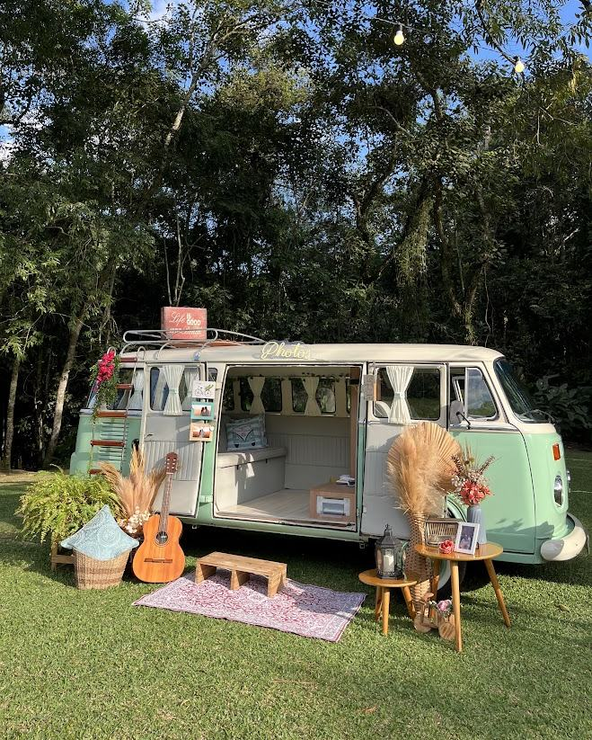

# La Kombine — site institucional

Site one-page da **La Kombine**, cabine fotográfica em Kombi retrô, totem retrô e
totem moderno para casamentos, festas e eventos corporativos.

🔗 **No ar em:** https://leo-dev18.github.io/lakombine/
📷 **Instagram:** [@la.kombine](https://www.instagram.com/la.kombine)

---

## O que precisa ser trocado antes de divulgar

Três coisas ficaram com valor provisório. Todas estão marcadas com `TROCAR` no código.

### 1. Número do WhatsApp — **obrigatório**

O placeholder é `5511900000000` (formato: `55` + DDD + número, sem espaços ou traços).
Aparece em **2 links** no `index.html`:

```bash
# troque em todos de uma vez:
sed -i 's/5511900000000/55SEUNUMERO/g' index.html
```

| Onde | Trecho |
|---|---|
| Botão principal do CTA final | `href="https://wa.me/5511900000000?text=..."` |
| Rodapé → Contato | `href="https://wa.me/5511900000000"` |

Os demais botões (“Solicitar orçamento”, “Quero a Kombi…”) apontam para `#contato`,
então rolam até o CTA e usam o mesmo link — não precisa mexer neles.

### 2. Fotos

Todo espaço de imagem é um `<div class="ph" data-slot="assets/nome.jpg">`.
O atributo `data-slot` diz **qual arquivo aquele espaço espera**. Para publicar uma foto real,
troque a `div` inteira por uma `img`:

```html
<!-- antes -->
<div class="ph" data-slot="assets/exp-kombi.jpg" data-label="Kombi Retrô"></div>

<!-- depois -->

```

Arquivos esperados (coloque em `assets/`):

| Arquivo | Onde aparece | Proporção sugerida |
|---|---|---|
| `kombi-01.jpg` | polaroid do topo | 4:3 |
| `tirinha-01..03.jpg` | tirinha de fotos do topo | 4:3 (recorte quadrado funciona) |
| `totem-01.jpg` | segunda polaroid do topo | 4:3 |
| `sobre-kombi.jpg` | seção “Quem somos” | 4:5 (retrato) |
| `exp-kombi.jpg` | card Kombi Retrô | 16:11 |
| `exp-totem-retro.jpg` | card Totem Retrô | 16:11 |
| `exp-totem-moderno.jpg` | card Totem Moderno | 16:11 |
| `galeria-01..08.jpg` | galeria horizontal | alterna 4:3 e 3:4 |

Sempre preencha o `alt` descrevendo a cena — é o que leitores de tela leem e o que o
Google usa para indexar as imagens.

**Dica de peso:** exporte em no máximo ~1600px de largura e qualidade 80. Fotos direto
do celular têm 4–8 MB e deixam o site lento no 4G dos convidados.

### 3. Depoimentos

Os três depoimentos vieram do perfil público da La Kombine no Casamentos.com.br e estão
atribuídos genericamente (“Avaliação no Casamentos.com.br”). **Confirme os textos e troque
pela atribuição real** (nome do casal + data/local do evento) — depoimento com nome
converte muito mais. O bloco está marcado com um comentário `ATENÇÃO` no `index.html`.

O mesmo vale para os números do hero (5,0 · 9 avaliações · 100% recomendam · Casamentos
Awards 2026): confira se continuam corretos antes de publicar.

---

## Estrutura

```
LaKombine/
├── index.html              # página inteira (one-page)
├── styles/
│   ├── fonts.css           # @font-face das fontes auto-hospedadas
│   └── main.css            # design system + todas as seções
├── scripts/main.js         # nav mobile, reveals, contadores, FAQ, galeria
├── assets/
│   ├── logo.png            # logo original
│   ├── favicon.svg         # ícone da aba
│   ├── apple-touch-icon.png
│   ├── og-image.png        # preview no WhatsApp/Instagram/Facebook
│   └── fonts/              # 14 arquivos .woff2 (subsets latin + latin-ext)
├── .nojekyll               # impede o Jekyll do GitHub Pages de ignorar arquivos
└── README.md
```

Seções, na ordem: Hero → Marquee → Sobre → Experiências → Como funciona → Galeria →
Depoimentos → FAQ → CTA final → Rodapé.

## Stack

HTML5 + CSS3 + JavaScript puro. **Sem build, sem dependências, sem CDN.**
É só abrir o `index.html` — ou servir a pasta:

```bash
python3 -m http.server 5500   # depois abra http://localhost:5500
```

## Paleta

Extraída direto do gradiente da logo:

| Token | Hex | Uso |
|---|---|---|
| `--teal-400` | `#61AFA1` | ponta clara da logo, detalhes decorativos |
| `--teal-500` | `#4E9488` | meio do gradiente |
| `--teal-700` | `#37766B` | botões, superfície escura principal |
| `--surface-1/2/3` | `#37766B → #316A60 → #204A43` | fundos que recebem texto branco |
| `--cream` | `#FBF5E9` | fundo claro (bege quente, pegada retrô) |
| `--sand` | `#F2E7D4` | fundo claro alternado |
| `--ink` | `#14312C` | texto e rodapé |
| `--amber` | `#E3A44F` | acento retrô (tags, estrelas, separadores) |

> **Por que os fundos não usam o verde claro da logo?** Texto branco sobre `#61AFA1`
> dá 2,6:1 de contraste — reprova em acessibilidade (o mínimo é 4,5:1). Por isso as áreas
> com texto usam a ponta escura do próprio gradiente da marca, e o verde claro fica nos
> elementos decorativos. Todos os 191 blocos de texto do site passam em **WCAG 2.1 AA**.

## Tipografia

Auto-hospedada em `assets/fonts/` (SIL Open Font License). Nada é buscado no Google.

- **Poppins** — títulos e interface
- **Inter** — texto corrido
- **Yellowtail** — os detalhes em manuscrito, ecoando o “Kombine” da logo

## Acessibilidade

- Contraste WCAG AA verificado por auditoria automatizada em todos os nós de texto
- Navegação por teclado com `:focus-visible` visível e link “pular para o conteúdo”
- `aria-expanded`/`aria-controls` no menu mobile, `Esc` fecha
- `prefers-reduced-motion` desliga marquee, selo giratório, contadores e reveals
- HTML semântico (`header`/`main`/`section`/`article`/`footer`) e dados estruturados
  `LocalBusiness` para o Google

## Deploy

Servido pelo GitHub Pages a partir do branch `main` do repositório `Leo-dev18.github.io`,
na subpasta `lakombine/`.
Qualquer push no `main` publica em ~1 minuto.
